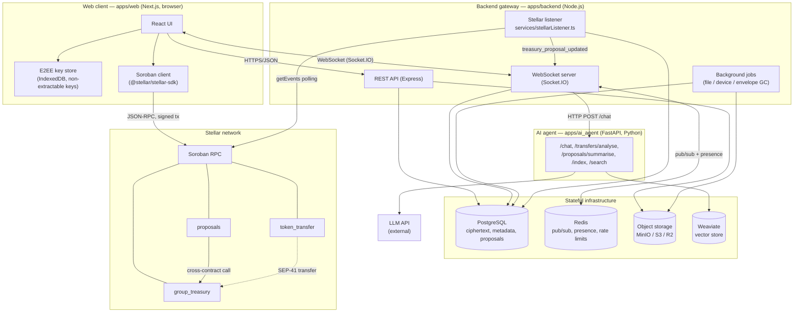

# System Architecture Overview

**Scope: orientation only.** This document exists so that someone who has never seen the
codebase can understand how the pieces fit together in about ten minutes. It deliberately
stays shallow — every component section ends with a link to the document that actually
specifies it. When this document and a per-app document disagree, the per-app document is
right and this one needs fixing.

For the exhaustive design specification, see the per-app documents linked throughout. For
a list of every document in the repository, see the [documentation index](README.md).

---

## The whole system in one diagram

### Protocols on each edge

| From | To | Protocol |
| --- | --- | --- |
| Web client | Backend REST | HTTPS, JSON, `Authorization: Bearer <JWT>` |
| Web client | Backend gateway | WebSocket (Socket.IO), JWT in the handshake `auth.token` |
| Web client | Soroban RPC | JSON-RPC over HTTPS, transactions signed in the browser wallet |
| Backend | PostgreSQL | TCP, via Drizzle ORM |
| Backend | Redis | RESP, pub/sub for cross-instance fan-out and presence |
| Backend | Object storage | S3 API (path-style against MinIO, virtual-host against S3/R2) |
| Backend | AI agent | HTTP POST, plaintext JSON |
| Backend listener | Soroban RPC | JSON-RPC `getEvents`, cursor-based polling every 5 s |
| AI agent | Weaviate | Weaviate Python client over HTTP |
| AI agent | LLM API | HTTPS to an external provider |
| `proposals` | `group_treasury` | Soroban cross-contract invocation |

---

## Components

### Web client — `apps/web`

**Responsibility.** The Next.js browser application. It is the only component that holds
user private keys: it derives them, stores them in IndexedDB, encrypts every message and
attachment before it goes over the wire, and decrypts everything that comes back. It also
builds and signs Soroban transactions directly against the user's wallet, so payments do
not pass through the backend.

**It must never** send a private key, a plaintext message body, or an unencrypted
attachment to the backend, and it must never trust the backend to tell it who a message
was from — sender identity is verified against the cryptographic session, not the
server-supplied metadata.

See: [E2EE architecture](../apps/web/docs/concepts-e2ee-architecture.md),
[message pipeline](../apps/web/docs/concepts-message-pipeline.md),
[Soroban client](../apps/web/docs/api-soroban-client.md).

### Backend gateway — `apps/backend`

**Responsibility.** A Node.js process running Express for REST and Socket.IO for realtime.
It authenticates devices, stores and routes ciphertext, fans messages out to every
recipient device, tracks presence and delivery receipts, brokers uploads to object
storage, and runs the chain listener and the scheduled cleanup jobs. Multiple instances
run behind the Redis adapter, so any device may be connected to any instance.

**It must never** be able to read message content — it stores and forwards opaque
ciphertext envelopes and must not acquire a decryption path. It must never accept a
client's claim about its own identity without verifying the JWT and confirming the device
row is present and unrevoked, and it must never hold custody of user funds; it observes
the chain, it does not sign for it.

See: [gateway architecture](../apps/backend/docs/concepts-gateway-architecture.md),
[delivery fan-out](../apps/backend/docs/concepts-delivery-fanout.md),
[WebSocket events](../apps/backend/docs/api-websocket-events.md).

### AI agent — `apps/ai_agent`

**Responsibility.** A FastAPI service exposing chat assistance, transfer risk analysis,
proposal summarisation, and vector indexing/search. It calls an external LLM provider and
stores embeddings in Weaviate.

**It must never** receive end-to-end encrypted message content that the user has not
explicitly submitted to it. Anything it is given leaves the E2EE trust boundary — it goes
to an external LLM provider in plaintext — so the boundary must stay explicit and
user-initiated. It is also not an authorisation component: nothing it returns should gate
a transfer or a withdrawal, since its output is advisory.

See: [AI agent README](../apps/ai_agent/README.md),
[RAG search architecture](../apps/ai_agent/docs/concepts-rag-search-architecture.md),
[transfer risk analysis](../apps/ai_agent/docs/concepts-transfer-risk-analysis.md).

### Soroban contracts — `contracts/`

Three contracts make up the on-chain surface.

- **`token_transfer`** — routes a SEP-41 token transfer between two addresses and emits a
  `transfer` event carrying an opaque `memo`. The memo is how an on-chain payment is
  correlated back to a chat message.
- **`group_treasury`** — holds pooled group funds. Tracks members and per-token balances,
  and runs a threshold-approval withdraw-proposal flow.
- **`proposals`** — DAO-style governance: create a proposal, vote yes/no until expiry,
  finalise on vote count, then execute — which, for a withdrawal, calls into
  `group_treasury`.

**They must never** trust a caller's claimed identity without `require_auth`, and must
never emit an event before the corresponding state write is committed — the backend
listener treats an event as proof that the state change happened.

See: [contracts README](../contracts/README.md),
[contract events reference](../contracts/docs/contracts-events.md),
[proposal lifecycle](../contracts/docs/concepts-proposal-lifecycle.md),
[WASM size and resource budget](../contracts/docs/concepts-resource-budget.md).

### PostgreSQL

**Responsibility.** The system of record for everything off-chain: users, devices and
their public prekeys, conversations and membership, message ciphertext and per-device
envelopes, delivery receipts, file metadata, and the off-chain mirror of treasury
proposals and votes.

**It must never** hold plaintext message bodies or user private keys. Ciphertext at rest
is the design; a schema change that lands readable content in a column is a break in the
threat model, not an optimisation.

### Redis

**Responsibility.** Cross-instance coordination — the Socket.IO adapter's pub/sub backbone,
presence state, per-device delivery channels, device-revocation notifications, and rate
limit counters.

**It must never** be treated as durable. Everything in Redis is reconstructible from
PostgreSQL or from a reconnecting client; a flushed Redis must degrade the system, not
lose data.

### Object storage (MinIO / S3 / R2)

**Responsibility.** Stores encrypted file attachments. The backend brokers access; the
same S3 client path serves local MinIO and production S3 or R2, differing only by
environment variables.

**It must never** receive an unencrypted attachment — files are encrypted in the browser
before upload — and must never be exposed as a public bucket, since object keys would then
be the only thing standing between an attacker and every stored file.

### Stellar network / Soroban RPC

**Responsibility.** Consensus, settlement, and the event stream. The backend reaches it
only through Soroban RPC's `getEvents`, polled on a cursor.

**It must never** be assumed synchronously consistent with the backend's database. Events
arrive seconds later, may be re-delivered on reconnect, and the ledger is the authority
whenever the two disagree.

See: [deployment and invocation](../contracts/docs/api-deployment-invocation.md).

---

## End-to-end path 1: sending an encrypted message

The point of this trace is that the backend never holds anything readable.

1. **Compose.** The user types into the React UI. The client loads the cryptographic
   session for the conversation from IndexedDB.
2. **Encrypt, per device.** The client encrypts the plaintext once per recipient *device* —
   not per user. A conversation of three users with two devices each produces one envelope
   per active device. Private keys never leave the browser.
3. **Emit.** The client emits `send_message` over its authenticated Socket.IO connection,
   carrying the message id, content type, and the map of per-device ciphertext envelopes.
4. **Validate and persist.** The gateway validates the payload shape and size (16 KB cap),
   applies the per-socket rate limit, and writes the message row plus its envelopes to
   PostgreSQL. It stores opaque bytes; it cannot decrypt them.
5. **Fan out.** `services/deliveryPipeline.ts` loads the conversation's active,
   non-revoked devices and emits a `message_envelope` event to each `device:${deviceId}`
   room containing only that device's envelope, plus a ciphertext-free `new_message` to the
   conversation room for unread counts. Recipients connected to a different gateway
   instance are reached through the Redis adapter.
6. **Decrypt.** Each recipient client receives its envelope, decrypts it with its own key
   material, advances the ratchet, and renders the message.
7. **Receipt.** The recipient acknowledges; `services/deliveryAggregation.ts` marks that
   device delivered and, once every active device of a recipient user has acknowledged,
   notifies the sender with `message_fully_delivered`.

> The full trace, including which services are implemented but *not* wired into the live
> send path, is in [delivery fan-out](../apps/backend/docs/concepts-delivery-fanout.md).
> Read that before changing anything in this path.

## End-to-end path 2: executing a treasury withdrawal

The point of this trace is that authority lives on-chain and the backend only observes.

1. **Propose.** A treasury member creates a withdrawal proposal. The proposal is recorded
   on-chain — `group_treasury::propose_withdraw` for the treasury's own threshold flow, or
   `proposals::create_proposal` for the governance flow — and the client signs the
   transaction with the user's wallet. The backend's REST treasury routes maintain an
   off-chain mirror in PostgreSQL for querying and UI, but that mirror is not the source of
   truth.
2. **Observe.** The contract emits `proposal_created`. Within about five seconds the
   Stellar listener's `getEvents` poll picks it up, upserts on
   `(contractId, proposalId)`, and emits `treasury_proposal_updated` into the linked
   conversation room. The upsert is what makes re-reading a page after a reconnect safe.
3. **Vote.** Each member signs an approve or reject transaction. `group_treasury` records
   one vote per member per proposal, emits `withdraw_vote` for every vote, and separately
   emits `proposal_approved` once approvals reach the configured threshold — or
   `proposal_rejected` once rejections reach the blocking minority, the point at which
   enough approvals can no longer be gathered.
4. **Execute.** Once the proposal has passed, execution moves the funds. In the governance
   flow, `proposals::execute_withdraw` checks the caller is a treasury member, checks the
   balance, calls `group_treasury::withdraw` cross-contract, and flips the status to
   `Executed`.
5. **Settle.** `group_treasury` emits `withdraw` as the tokens move, and the ledger closes.
   The listener picks up the events and updates the mirror; connected clients see the
   status change pushed over WebSocket.

> **Known gap.** The backend listener subscribes to a `proposal_executed` topic, but no
> contract publishes that topic — `proposals` publishes the truncated symbols `executed`
> and `execut` instead. An executed proposal therefore does not currently transition to
> `executed` in the off-chain mirror through the listener. This is documented per-event in
> the [contract events reference](../contracts/docs/contracts-events.md).

---

## Where to go next

| You want to… | Read |
| --- | --- |
| Change how messages are delivered | [delivery fan-out](../apps/backend/docs/concepts-delivery-fanout.md) |
| Change the WebSocket surface | [WebSocket events](../apps/backend/docs/api-websocket-events.md), [payloads](../apps/backend/docs/contracts-websocket-payloads.md) |
| Change client-side crypto | [E2EE architecture](../apps/web/docs/concepts-e2ee-architecture.md) |
| Change or deploy a contract | [deployment and invocation](../contracts/docs/api-deployment-invocation.md) |
| Consume a new on-chain event | [contract events reference](../contracts/docs/contracts-events.md) |
| Understand the security posture | [threat model](threat-model.md) |
| Operate a deployment | [runbook](runbook.md), [observability](observability.md) |
| Find any other document | [documentation index](README.md) |
